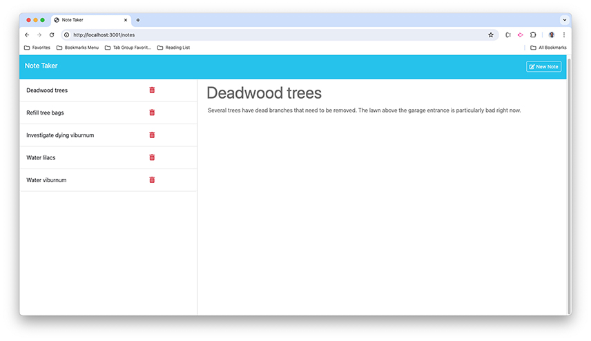

# Note Taker

## Description
Note Taker allows users to write and save notes, for example a to do list, retrieve them, and delete them.

## Table of Contents
- [Installation](#installation)
- [Usage](#usage)
- [Contributing](#contributing)
- [Tests](#tests)
- [License](#license)
- [Questions](#questions)

## Installation
Note Taker requires no installation.

## Usage
When users navigate to the site, they are first presented with a landing page. To begin taking notes, they click on the "Get Started" button.

On the form page, users type a note title and their note in the fields filled with default text, which will disappear once they click in the field. When users begin typing in either field, a "Clear Form" button will appear in the header, allowing them to abandon the current note. When both fields have data, a "Save Note" button will also appear in the header. Clicking it allows users to save the current note.

On the left-hand side of the screen is a list of titles of notes that have been saved, and when users save a new note, it will be added to the list. To view a note, users click on the note title in the list. To delete a note, users click on the trashcan icon to the left of each note. While viewing a note, users can click the "New Note" button to clear the form so that it's ready to record the title of a new note and the new note's text.

A screen shot of the form page is below.

## Contributing
To contribute to Note Taker, clone this repository locally and commit your code to a separate branch.

## Tests
If you are making core library changes, please write unit tests for your code and ensure that everything is working correctly before opening a pull request.

## License

MIT License

## Questions
You can see my github repositories at [MatthewWilliamsCMH](https://github.com/MatthewWilliamsCMH/).  
Drop me a line at [matthewwilliamscmh@icloud.com](mailto:matthewwilliamscmh@icloud.com).